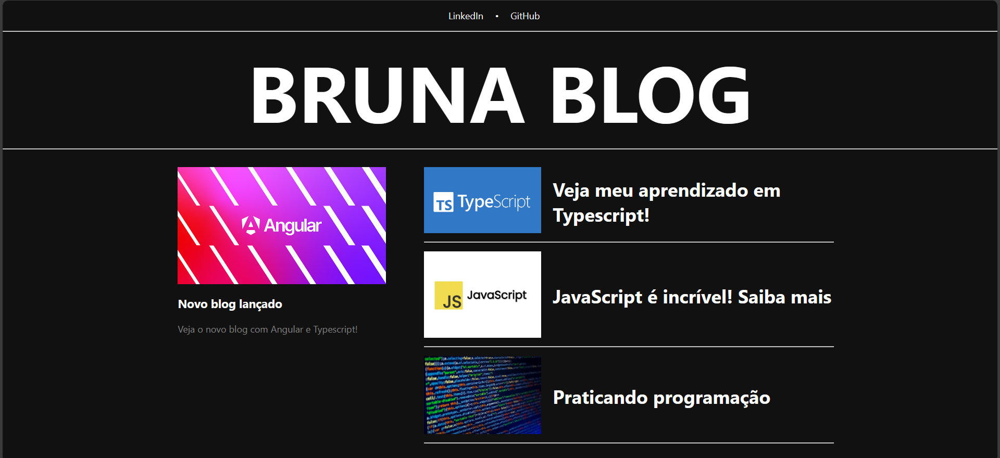

# BLOG #

## 📝 Descrição do projeto ##

Blog feito em Angular para o Bootcamp Desenvolvimento Frontend com Angular da [DIO](https://web.dio.me/track/coding-future-banco-pan-desenvolvimento-frontend-com-angular).

## 🔧 Ferramentas e tecnologias ##

* Angular 14.1.2
* Typescript
* JavaScript
* Node.js

## 📌 Funcionalidades ##

Blog criado com Angular, utilizando componentes dinâmicos para atualizar o conteúdo e as imagens. Os próximos passos serão deixar o site responsivo e trabalhar mais no conteúdo de cada página.

## 🚶 Acesso ##

Deploy disponível no [Vercel](https://blog-ochre-theta-51.vercel.app/).

## 👩🏻‍💻 Feito por ##

Desenvolvido com ♥ por [Bruna Soncini](www.linkedin.com/in/brunasoncini/).
